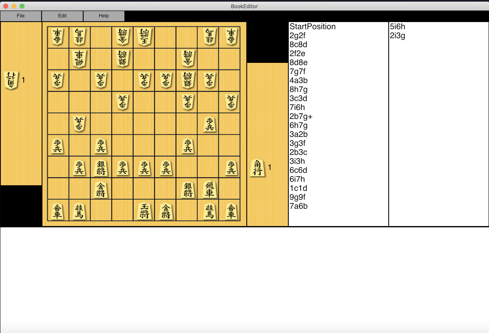

# BookEditor



## これは何？
コンピュータ将棋の定跡編集ソフトになる予定のものです。  
現在は閲覧機能のみ付いています。

## 動作環境
Mac, Ubuntu, Windows  
(要 DotnetCore3.0 SDK)

## 実行方法
```
dotnet run
```

## LICENSE
用意中....

## 素材
将棋アプリ用クリエイティブコモンズ画像  
http://mucho.girly.jp/bona/